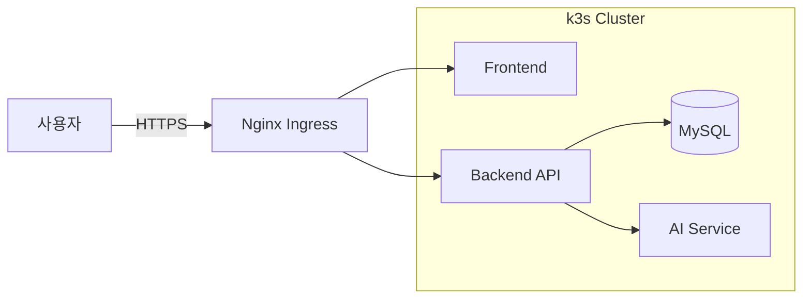

# MSP Team06 — 프로젝트명

> MSP Architect Training 2026 · MSP Team06 ([팀원 이름들])

한 줄 프로젝트 소개를 여기에. (예: "K8s 기반 OO 서비스를 GitOps로 운영하는 플랫폼")

## 👥 팀원

| 역할 | 이름 | 주요 담당 | GitHub |
|------|------|-----------|--------|
| 팀장 |  | 인프라 · ArgoCD | @ |
| 팀원 |  | Backend · DB | @ |
| 팀원 |  | Frontend · UX | @ |

## 🎯 프로젝트 목표

-
-
-

## 🏗️ 시스템 아키텍처



> 📖 상세 아키텍처는 [Wiki — 시스템 아키텍처](../../wiki/10-시스템-아키텍처) 참조

## 🛠️ 기술 스택

| 계층 | 기술 |
|------|------|
| Frontend |  |
| Backend |  |
| Database |  |
| Infra | k3s, Helm, ArgoCD |
| CI/CD | GitHub Actions, ArgoCD |
| Monitoring | Prometheus, Grafana, Loki |

## 🚀 빠른 시작

### 사전 요구사항
- Docker / Docker Compose
- kubectl, helm
- (기타)

### 로컬 실행
```bash
git clone git@github.com:Team-msp-architect-2026/msp-team06.git
cd msp-team06
cp .env.example .env
docker compose up -d
# http://localhost:3000
```

### K8s 배포 (ArgoCD)
```bash
kubectl apply -f k8s/argocd/application.yaml
```

## 📂 디렉토리 구조

```
.
├── .github/             # Issue/PR 템플릿, CODEOWNERS
├── docs/                # 설계 문서 (ADR 등)
├── k8s/                 # Kubernetes 매니페스트
├── helm/                # Helm Chart
├── frontend/            # 프론트엔드
├── backend/             # 백엔드 API
└── README.md
```

## 📚 문서

| 문서 | 위치 |
|------|------|
| 요구사항 정의서 | [Wiki](../../wiki/01-요구사항-정의서) |
| 시스템 아키텍처 | [Wiki](../../wiki/10-시스템-아키텍처) |
| API 명세서 | [Wiki](../../wiki/30-API-명세서) |
| ERD | [Wiki](../../wiki/40-ERD) |
| Runbook | [Wiki](../../wiki/50-인프라-Runbook) |
| ADR | [docs/adr/](docs/adr/) |

## 🤝 기여 방법

[CONTRIBUTING.md](CONTRIBUTING.md) 참조

## 📄 라이선스

[MIT](LICENSE)
